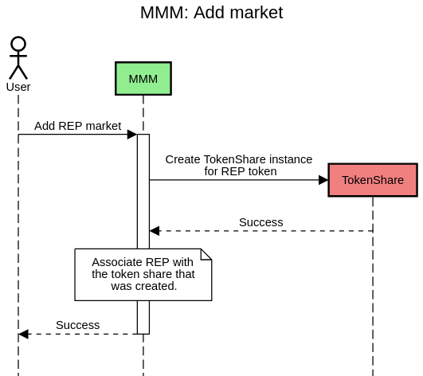
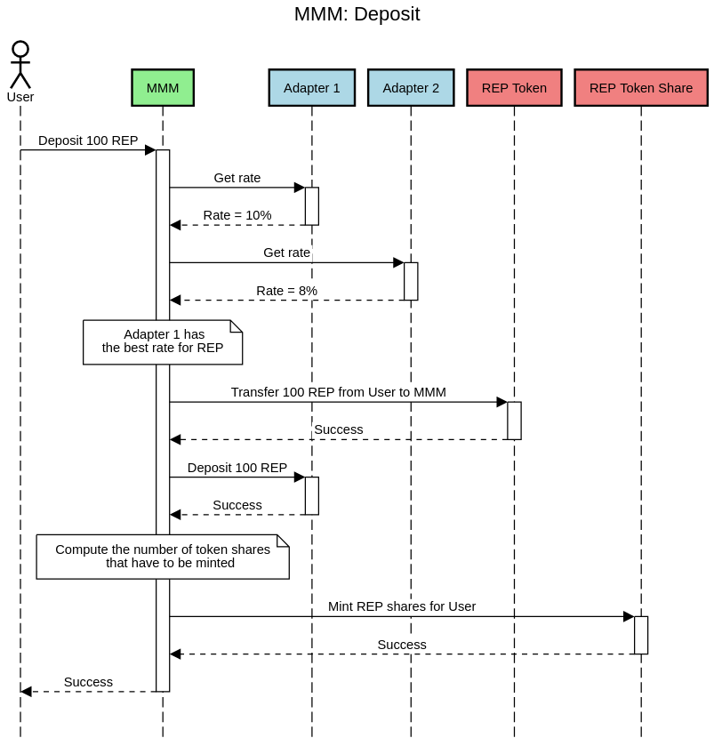
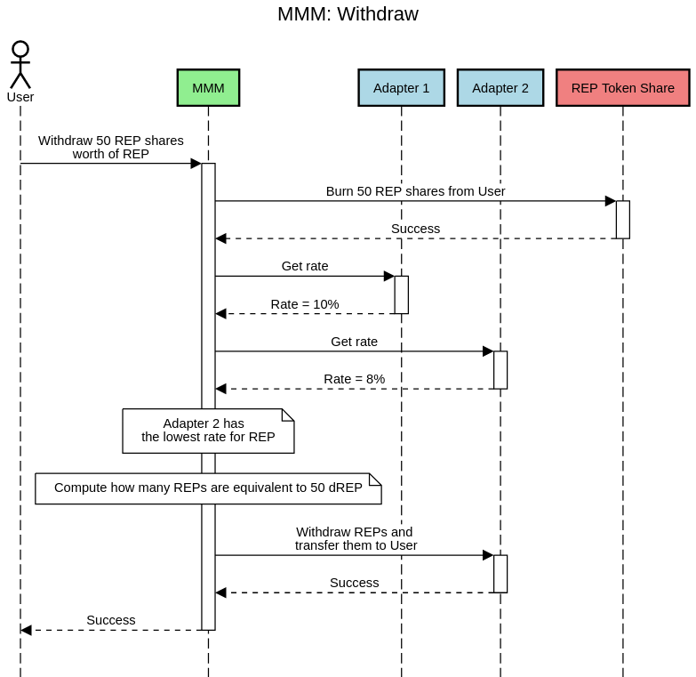

# MetaMoneyMarket

_An open source ethereum protocol that sits on top of multiple money markets, depositing funds into the highest rate, and rebalancing when it makes sense, to help you earn max interest_

[](https://circleci.com/gh/Altoros/sovereign)

## Setup

Clone the repository and install its dependencies:

```
git clone git@github.com:Altoros/sovereign.git
cd soverign
yarn
```

Then create a `.env` file. You can copy the `.env.example` file and replace the
example values with proper ones. The environment variables are:

- `REACT_APP_NOMICS_API_KEY`: An API key for [Nomics](https://nomics.com)
- `REACT_APP_RPC_URL`: A RPC URL that will be used to show some information
  until the user connects its wallet.

### Test locally

Start a ganache instance with network id 50:

```
ganache-cli -d -i 50
```

Then in another terminal deploy the contracts:

```
yarn deploy:local
```

and then start the app:

```
yarn start
```

Connect MetaMask to `localhost:8545` and import the first account from ganache.

### Test in Rinkeby/Kovan

Using the private key for an account with Rinkeby ether and a URL for a Rinkeby
RPC endpoint, deploy the contracts:

```
RINKEBY_PRIVATE_KEY=abcdef... RINKEBY_RPC_URL=https://rinkeby.infura.io/... yarn deploy:rinkeby
```

Then start the app and connect MetaMask to Rinkeby:

```
yarn start
```

To deploy in kovan, follow the same steps but replacing everything for "Kovan"
(`KOVAN_PRIVATE_KEY`, `KOVAN_RPC_URL`, `yarn deploy:kovan`, etc.)

### Deploy in Mainnet

Using the private key for an account with Mainnet ether and a URL for a Mainnet
RPC endpoint, deploy the contracts:

```
MAINNET_PRIVATE_KEY=abcdef... MAINNET_RPC_URL=https://mainnet.infura.io/... yarn deploy:mainnet
```

Then start the app and connect MetaMask to the Mainnet:

```
yarn start
```

### Adding new tokens

The `blockchain/migrations/2_deploy_meta_money_market.js` file has some
configuration objects that specify the tokens that will be supported by the
deployed `MetaMoneyMarket` contract. To add new supported tokens at deploy time,
modify the `tokens` property of the corresponding object. For example, for
adding support for USDC when deploying in the mainnet, you should modify the
`mainnetConfig.tokens` array, adding this object:

```
{
  name: 'usdc',
  tokenAddress: '0xA0b86991c6218b36c1d19D4a2e9Eb0cE3606eB48',
  cTokenAddress: '0x39aa39c021dfbae8fac545936693ac917d5e7563',
  marketId: 2
}
```

`name` is only used for logging. `tokenAddress` is the address of the
token. `cTokenAddress` is the cUSDC token in the Compound protocol.
`marketId` is the market id for USDC in the dYdX protocol.

## The MetaMoneyMarket contract

The code for the `MetaMoneyMarket` (MMM) contract can be found in
`blockchain/contracts/MetaMoneyMarket.sol`.

Initially, the MMM doesn't support any tokens. Anybody can add support for any
ERC20 token by using the `addMarket(address)` method. This method will enable
that token and it will mint a new token that represents shares in the total
deposited amount for that token.



When a user deposits tokens, some amount of those token shares will be minted
for them. The tokens will then be deposited in the best underlying market.



If later a user burns some of those token shares, it will receive an amount of
tokens according to the exchange rate at that moment. These tokens will be taken
from the market with the lowest rate. If that market doesn't have enough tokens,
the next lowest market will be used, and so on.


